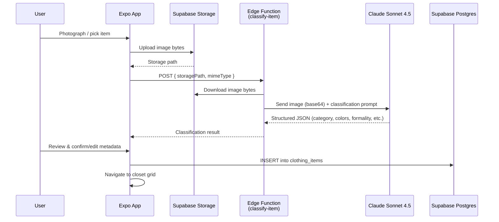

# StyleSense — Milestone 1: Photograph → Classify → Save → View

Build the core wardrobe cataloging pipeline end-to-end: auth, photograph a clothing item, AI classification via Claude, persist to Supabase, and view the closet grid.

## Data Flow



---

## Proposed Changes

### 1. Project Scaffolding

#### [NEW] Expo Project (root)

Initialize with the `tabs` template which includes Expo Router + TypeScript out of the box:

```bash
npx create-expo-app@latest ./ -t tabs --no-install
```

Then install all dependencies in one batch:

```bash
npx expo install @supabase/supabase-js expo-sqlite expo-image-picker zustand nativewind tailwindcss react-native-reanimated react-native-safe-area-context
```

Configure NativeWind v4:
- `tailwind.config.js` — content paths, NativeWind preset
- `global.css` — Tailwind directives
- `babel.config.js` — add `nativewind/babel` preset, `jsxImportSource: "nativewind"`
- `metro.config.js` — wrap with `withNativeWind`
- `nativewind-env.d.ts` — TypeScript reference

#### [NEW] `.env`

```env
EXPO_PUBLIC_SUPABASE_URL=<project-url>
EXPO_PUBLIC_SUPABASE_ANON_KEY=<anon-key>
```

> [!IMPORTANT]
> The Anthropic API key and OpenWeather key live **only** in the Edge Function environment — never in the app bundle.

---

### 2. Supabase Backend Setup

#### [NEW] `supabase/migrations/001_clothing_items.sql`

```sql
-- Clothing items table
CREATE TABLE clothing_items (
  id UUID PRIMARY KEY DEFAULT gen_random_uuid(),
  user_id UUID REFERENCES auth.users(id) ON DELETE CASCADE NOT NULL,
  storage_path TEXT NOT NULL,              -- e.g. clothing/{user_id}/{item_id}.jpg
  category TEXT NOT NULL,
  subcategory TEXT,
  primary_color TEXT,                      -- hex value e.g. #1B3A5C
  primary_color_name TEXT,                 -- display name e.g. "Navy"
  secondary_colors JSONB DEFAULT '[]',     -- [{hex: "#fff", name: "White"}]
  formality INTEGER NOT NULL CHECK (formality BETWEEN 1 AND 5),
  seasons TEXT[] DEFAULT '{}',
  tags TEXT[] DEFAULT '{}',
  notes TEXT,
  created_at TIMESTAMPTZ DEFAULT NOW()
);

-- RLS: users can only access their own items
ALTER TABLE clothing_items ENABLE ROW LEVEL SECURITY;

CREATE POLICY "Users can view own items"
  ON clothing_items FOR SELECT
  USING (auth.uid() = user_id);

CREATE POLICY "Users can insert own items"
  ON clothing_items FOR INSERT
  WITH CHECK (auth.uid() = user_id);

CREATE POLICY "Users can update own items"
  ON clothing_items FOR UPDATE
  USING (auth.uid() = user_id);

CREATE POLICY "Users can delete own items"
  ON clothing_items FOR DELETE
  USING (auth.uid() = user_id);
```

> [!NOTE]
> **Storage path instead of URL:** We store `clothing/{user_id}/{item_id}.jpg` and generate signed URLs at runtime. This is standard practice — it survives bucket renames, CDN changes, and domain migrations. No broken links.

#### [NEW] Supabase Storage Bucket

A `clothing` bucket (private, RLS-protected). Users upload to `clothing/{their_user_id}/{item_id}.jpg`.

Storage policy: authenticated users can upload/read files inside their own `{user_id}/` prefix.

---

### 3. Edge Function: `classify-item`

#### [NEW] `supabase/functions/classify-item/index.ts`

**Purpose:** Receives a storage path, downloads the image from Supabase Storage, sends it to Claude Sonnet 4.5 with the classification prompt, returns structured JSON.

**Flow:**
1. Verify the caller is authenticated (extract JWT from `Authorization` header)
2. Download the image from Storage using the service role key
3. Convert to base64
4. Call Claude with the classification prompt (see below)
5. Parse Claude's JSON response
6. Return to the client

**Classification prompt (core of the AI feature):**

```
You are a fashion expert and clothing analyst. Analyze this clothing item photograph and return a JSON classification.

You must handle BOTH Western and South Asian / Indian ethnic clothing. Do NOT force ethnic garments into Western categories.

Return ONLY valid JSON matching this schema:
{
  "category": one of ["top", "bottom", "outerwear", "footwear", "ethnic_top", "ethnic_bottom", "ethnic_full", "accessory"],
  "subcategory": string — e.g. "t-shirt", "button-up", "jeans", "chinos", "kurta", "sherwani", "achkan", "bandhgala", "nehru_jacket", "dhoti", "churidar", "sneakers", "loafers", "mojari", etc.,
  "primary_color": {"hex": "#XXXXXX", "name": "Color Name"},
  "secondary_colors": [{"hex": "#XXXXXX", "name": "Color Name"}, ...],
  "formality": integer 1-5 (1=very casual gym/loungewear, 2=casual everyday, 3=smart casual, 4=business/semi-formal, 5=black tie/wedding formal),
  "seasons": array of ["summer", "fall", "winter", "spring", "all"],
  "suggested_tags": array of descriptive strings e.g. ["linen", "slim fit", "wedding-appropriate", "embroidered", "block-print"],
  "confidence": float 0-1
}

Guidelines:
- For ethnic_full: garments worn as a complete outfit (e.g., sherwani with attached bottom)
- Formality for ethnic wear: kurta (casual cotton) = 2, kurta (silk/occasion) = 3-4, sherwani/achkan = 4-5
- Be specific with subcategory — "henley" not just "top", "mojari" not just "shoes"
- Identify fabric if visible (linen, cotton, silk, denim, wool, polyester)
- Note patterns in tags (striped, plaid, solid, paisley, block-print, embroidered)
```

**Environment secrets needed on the Edge Function:**
- `ANTHROPIC_API_KEY`
- `SUPABASE_URL` (auto-injected)
- `SUPABASE_SERVICE_ROLE_KEY` (auto-injected)

---

### 4. App: Types & Lib Layer

#### [NEW] `types/index.ts`

TypeScript interfaces for `ClothingItem`, `ClothingClassification`, `ColorInfo`, occasion enum, category enum.

#### [NEW] `lib/supabase.ts`

Supabase client initialized with `expo-sqlite/localStorage` for session persistence. Exports:
- `supabase` client instance
- `getSignedUrl(storagePath)` helper — generates a 1-hour signed URL for a storage path

#### [NEW] `lib/anthropic.ts`

Wrapper functions that call the Edge Functions (NOT Claude directly). Exports:
- `classifyClothingItem(storagePath: string, mimeType: string): Promise<ClothingClassification>`

---

### 5. App: State Management

#### [NEW] `store/auth.ts`

Zustand store for auth state:
- `user`, `session`, `loading`
- `signUp(email, password)`, `signIn(email, password)`, `signOut()`
- Listens to `onAuthStateChange`

#### [NEW] `store/closet.ts`

Zustand store for wardrobe:
- `items: ClothingItem[]`, `loading`, `filter: { category: string | null }`
- `fetchItems()` — loads from Supabase with signed URLs
- `addItem(item)` — inserts to DB
- `setFilter(category)` — for closet filtering
- `deleteItem(id)` — removes item + storage file

---

### 6. App: Screens

#### [MODIFY] `app/_layout.tsx`

Root layout: import `global.css`, wrap with auth state listener, redirect to auth screens if not logged in.

#### [NEW] `app/auth/login.tsx`

Minimal but polished login screen:
- Email + password fields
- "Sign In" button
- Link to signup
- Error display
- Dark theme with accent colors

#### [NEW] `app/auth/signup.tsx`

Signup screen:
- Email + password + confirm password
- "Create Account" button
- Link back to login

#### [MODIFY] `app/(tabs)/_layout.tsx`

Configure 4 tabs: Closet, Add Item, Outfits (placeholder for M2), Profile.
Custom tab bar icons, dark theme styling.

#### [MODIFY] `app/(tabs)/closet.tsx` (was `index.tsx` from template)

Closet grid screen:
- Category filter chips at top (All, Tops, Bottoms, Outerwear, Footwear, Ethnic, Accessories)
- FlatList grid (2 columns) of `ItemCard` components
- Pull-to-refresh
- Empty state with prompt to add items
- Tap an item → navigate to item detail (stretch, or just show a modal)

#### [MODIFY] `app/(tabs)/add.tsx` (was `explore.tsx` from template)

Add item flow — a multi-step screen:
1. **Capture:** Two buttons — "Take Photo" / "Choose from Library" using `expo-image-picker`
2. **Uploading:** Show the photo with a loading spinner while uploading to Storage + calling classify Edge Function
3. **Review:** Display Claude's classification as editable fields (category dropdown, subcategory text, color swatches, formality slider 1–5, season checkboxes, tags as chips). User can edit anything.
4. **Save:** Confirm button → write to `clothing_items` → navigate to closet

#### [NEW] `app/(tabs)/outfits.tsx`

Placeholder screen for Milestone 2. Shows "Coming Soon" with a teaser of what's next.

#### [NEW] `app/(tabs)/profile.tsx`

Minimal profile screen:
- Display user email
- "Sign Out" button
- App version

---

### 7. App: Components

#### [NEW] `components/ItemCard.tsx`

Grid card for closet view:
- Item photo (loaded via signed URL)
- Category badge
- Subcategory label
- Small color dot(s)

#### [NEW] `components/CategoryFilter.tsx`

Horizontal scrollable chip list for filtering closet by category.

#### [NEW] `components/ClassificationReview.tsx`

The review/edit form shown after Claude classifies an item:
- Category dropdown
- Subcategory text input
- Color display (hex swatch + name)
- Formality slider (1–5 with labels)
- Season toggle chips
- Tags as editable chip list
- Confidence indicator from Claude

---

## Design Direction

> [!TIP]
> **Design language:** Dark mode primary, with warm accent tones (amber/gold) that work well for a fashion app. Think premium, minimal, magazine-editorial feel. Typography: Inter or Outfit (Google Fonts via expo-google-fonts). Glassmorphic cards for item display. Subtle haptic feedback on interactions.

- **Color palette:** Background `#0A0A0A`, Surface `#1A1A1A`, Accent `#D4A574` (warm gold), Text `#F5F5F5`, Muted `#888`
- **Cards:** Rounded corners (16px), slight elevation, image fills top 70% of card
- **Animations:** Fade-in on list items, scale-on-press for buttons, smooth sheet transitions

---

## Open Questions

> [!IMPORTANT]
> **Supabase project:** Do you already have a Supabase project created for this, or should I guide you through creating one? I need the project URL and anon key before we can wire up the backend.

> [!IMPORTANT]
> **Anthropic API key:** Do you have an Anthropic API key ready? We'll need it set as an Edge Function secret.

> [!NOTE]
> **Physical device vs emulator:** For testing the camera, you'll need a physical device (or Expo Go). Are you testing on an Android phone, iPhone, or emulator? This affects how we handle camera permissions.

---

## Verification Plan

### Automated Tests
1. **Edge Function unit test:** Send a sample clothing image to the classify-item function, verify JSON response matches expected schema
2. **Supabase RLS test:** Verify that a user cannot read/write another user's clothing items

### Manual Verification (End-to-End)
1. Open app → see login screen → sign up → redirected to closet (empty state)
2. Navigate to "Add Item" tab → take photo of a kurta → see upload progress
3. Claude classifies it → review screen shows `ethnic_top / kurta / formality: 3` → edit if needed → save
4. Navigate to closet → see the kurta in the grid
5. Add 3–4 more items (jeans, button-up, sneakers) → verify category filter works
6. Sign out → sign back in → closet items persist

### Demo Recording
- Record a screen capture of the full flow for portfolio use
